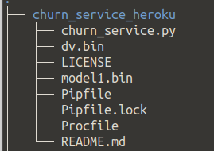
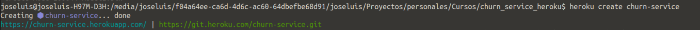
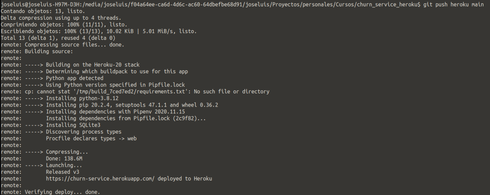
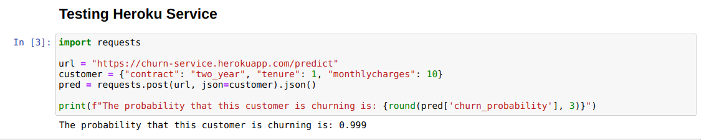
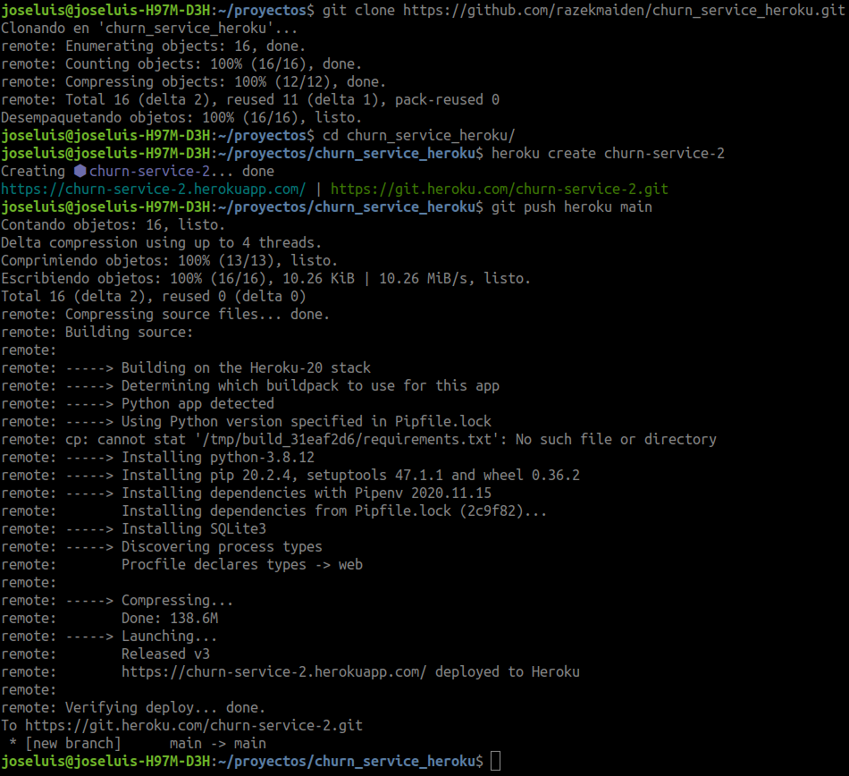

# Deploy Churn Service on Heroku (#mlzoomcamp)

In this repo I show how to deploy the churn service in Heroku.  Heroku is a platform as a service (PaaS) that enables developers to build, run, and operate applications entirely in the cloud.

It supports several programming languages like Java, Node.js, Scala, Clojure, Python, and others. The Heroku network runs the customer's apps in virtual containers called "Dynos."

**1.-** Create a free Heroku account. For this, go to the following url: [https://signup.heroku.com/](https://signup.heroku.com/) 

 

**Note**: Some of the instructions are similar to the views in #mlzoomcamp

**2.-** Install pipenv.
> pip install pipenv

**3.-** Create a directory to store the project. The code of the app and model used should be located in this directory.

**4.-** Create a virtual environment for the project with pipenv.
> pipenv --three

**5.-** Install the following dependencies with pipenv.
> pipenv install flask gunicorn scikit-learn==1.0

**6.-** Create a file called Procfile. This file allow us explicitly declare what command should be executed to start our app, we need a Procfile in the root directory of our web application. In this case the Procfile contains the following instruction:
> web: gunicorn churn_service:app

This declares a single process type web, and the command needed to run it. Also, in this tutorial it is assumed that the name of the file that contains the app is "churn_service"

At this point the directory should have a structure similar to what you see in the image.

 

**7.-** Start a repository inside the project folder
> git init

**8.-** Add the files to the repository
> git add .

**9.-** Commit all changes
> git commit -m "commit message"

**10.-** Install Heroku CLI. For linux, just type the following line:
> sudo snap install --classic heroku

You can validate that Heroku CLI is correctly installed, consulting the version:

> heroku -v

The result should be something similar to the image:

**11.-** Heroku CLI is associated with our heroku account, for this we must write in the terminal:
> heroku login

**12.-** Once logged in with Heroku CLI, proceed to create a unique name for the web application.
>heroku create [unique name]

In this case I have called the application churn-service. 

 

**13.-** Finally using Heroku CLI, we push the application. Be careful, not to be confused with push to the remote repository.
> git push heroku main

**Note**: Assuming we have worked on the "main" branch

In the terminal, we can see the progress while the application is "uploaded" to Heroku.

**Note**: You can see that Heroku when building the container, first tries to install the dependencies from the "requirements.txt" file. Not finding it, it proceeds to install based on Pipfile.

**14.-** We will be able to make predictions using the python request module, just as it was seen in the #mlzoomcamp course.

 

## Deploy this repo (fast testing)
In case you want to test the deploy directly, it is possible to use the code from this repository directly. For this, it is first necessary to clone the repository to your machine with the following commands:
> git clone https://github.com/razekmaiden/churn_service_heroku.git

Then you must go inside the cloned repository and open a terminal. Assuming that you already have the Heroku CLI configured, you will need to perform steps 12 and 13 to deploy the model in heroku.

 

 